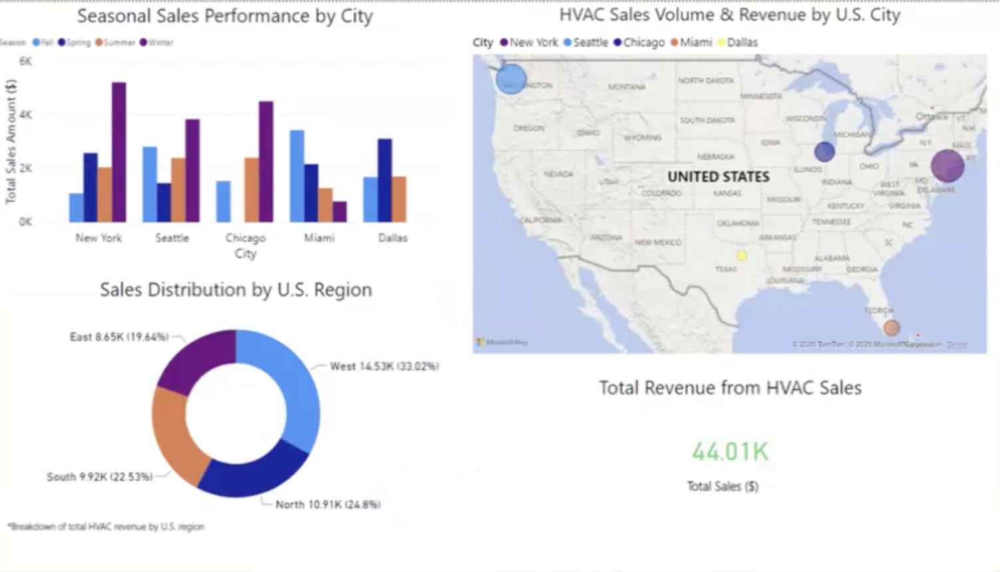

# HVAC Sales Forecasting & Business Intelligence Dashboard

## Project Overview
This project analyzes HVAC sales trends across U.S. regions and seasons to identify demand patterns and support better inventory planning. Using **Power BI**, the dashboard explores how geographic location and seasonal changes influence HVAC product demand.

The goal of this analysis is to help organizations better **anticipate seasonal demand, optimize inventory allocation, and improve marketing strategies** based on regional and seasonal sales patterns.

## Dataset & Analysis
The analysis combines HVAC sales transaction data with geographic and seasonal indicators to explore demand patterns across different cities and regions.

Key analytical steps included:

- Identifying **seasonal trends in HVAC product demand**
- Comparing sales performance across **U.S. cities and regions**
- Visualizing geographic demand concentrations
- Evaluating how seasonal shifts impact **inventory planning and product demand**

## Dashboard Visualizations

### Seasonal Sales Performance by City
This clustered bar chart compares HVAC sales across multiple cities and seasons. Each city is segmented by **Winter, Spring, Summer, and Fall** to highlight seasonal demand trends.

The visualization shows that **Chicago and New York experience stronger winter sales**, likely driven by heating product demand, while **Dallas and Miami peak in summer months** due to increased cooling demand.

These insights support **seasonal inventory planning and targeted marketing strategies by city**.

### Sales Distribution by U.S. Region
The donut chart displays the distribution of total HVAC sales across U.S. regions.

The **West region leads with approximately 33% of total revenue**, followed by the East and North regions. This visualization helps identify which regions generate the most HVAC revenue and where inventory, marketing, and distribution resources should be prioritized.

### Geographic Sales Map
The interactive map visualizes HVAC sales at the city level using bubble markers, where bubble size corresponds to total revenue.

Larger markers indicate cities with higher HVAC sales. The visualization highlights **New York City, Seattle, and Chicago as major contributors to overall revenue**, emphasizing geographic demand concentrations.

This insight supports improved **logistics planning, regional distribution strategies, and targeted marketing efforts**.

### Total Sales KPI
The KPI card displays the **total HVAC sales revenue across all transactions**, which amounts to approximately **$44,000**.

This metric provides a high-level summary of overall sales performance and helps quantify the scale of HVAC operations within the dataset.

## Key Business Insights

By combining **seasonal, regional, and geographic sales patterns**, organizations can make more informed decisions about:

- Inventory allocation by region and season  
- Seasonal marketing campaigns  
- Distribution and logistics planning  
- Forecasting HVAC product demand  

Business Intelligence dashboards like this allow companies to move from **reactive inventory management to predictive planning**.

## Tools Used
- Power BI  
- Excel  
- Data Visualization  
- Business Intelligence Analysis  

## Dashboard Preview

## Files Included
- `CIS405-Group Project.pbix` – Power BI dashboard file  
- `hvac-dashboard-preview.png` – dashboard visualization preview  
- `README.md` – project documentation
